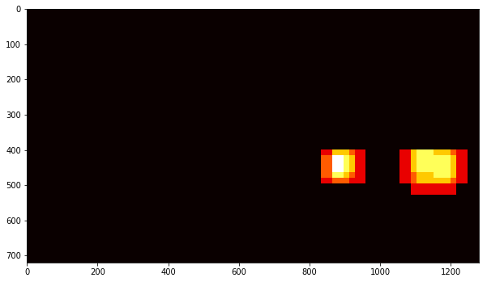
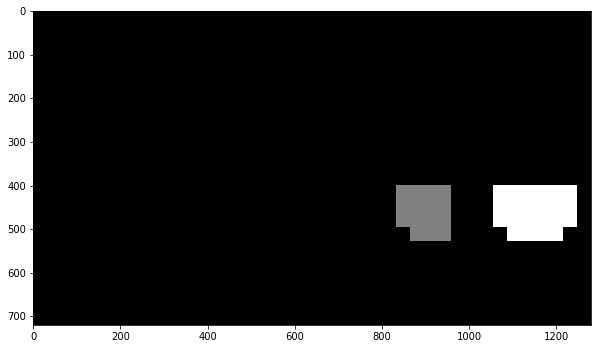

# Vehicle Detection and Tracking Project
This is the code for fourth project (Vehicle Detection and Tracking)

## The goals / steps of this project are the following:

- Perform a Histogram of Oriented Gradients (HOG) feature extraction on a labeled training set of images and train a classifier Linear SVM classifier
- Optionally, you can also apply a color transform and append binned color features, as well as histograms of color, to your HOG feature vector.
Note: for those first two steps don't forget to normalize your features and randomize a selection for training and testing.
- Implement a sliding-window technique and use your trained classifier to search for vehicles in images.
- Run your pipeline on a video stream (start with the test_video.mp4 and later implement on full project_video.mp4) and create a heat map of recurring detections frame by frame to reject outliers and follow detected vehicles.
- Estimate a bounding box for vehicles detected.

### 1. Provide a Writeup / README that includes all the rubric points and how you addressed each one. You can submit your writeup as markdown or pdf. 

All of the code for the project is contained in the Jupyter notebook vehicle_detection_project.ipynb

### Histogram of Oriented Gradients (HOG)
1. Explain how (and identify where in your code) you extracted HOG features from the training images.
I began by loading all of the vehicle and non-vehicle image paths from the provided dataset. The figure below shows a random sample of images from both classes of the dataset. 

 

The code for extracting HOG features from an image is defined by the method get_hog_features and is contained in the cell titled "Define Method to Convert Image to Histogram of Oriented Gradients (HOG)." The figure below shows a comparison of a car image and its associated histogram of oriented gradients, as well as the same for a non-car image.
 

The method extract_features in the section titled "Method to Extract HOG Features from an Array of Car and Non-Car Images" accepts a list of image paths and HOG parameters (as well as one of a variety of destination color spaces, to which the input image is converted), and produces a flattened array of HOG features for each image in the list.

Next, in the section titled "Extract Features for Input Datasets and Combine, Define Labels Vector, Shuffle and Split," I define parameters for HOG feature extraction and extract features for the entire dataset. These feature sets are combined and a label vector is defined (1 for cars, 0 for non-cars). The features and labels are then shuffled and split into training and test sets in preparation to be fed to a linear support vector machine (SVM) classifier. The table below documents the twenty-five different parameter combinations that I explored.

### 2. Explain how you settled on your final choice of HOG parameters.
I experimented with a number of different combinations of color spaces and HOG parameters and trained a linear SVM using different combinations of HOG features extracted from the color channels. For HLS color space the L-channel appears to be most important, followed by the S channel. I discarded RGB color space, for its undesirable properties under changing light conditions. YUV and YCrCb also provided good results, but proved to be unstable when all channels were used. There was relatively little variation in the final accuracy when running the SVM with some of the individual channels of HSV,HLS and LUV.

The final parameters chosen were YUV colorspace, 11 orientations, 16 pixels per cell, 2 cells per block, and ALL channels of the colorspace. 

### 3. Describe how (and identify where in your code) you trained a classifier using your selected HOG features (and color features if you used them).

Before training the SVM classfier, the features were extracted from the car and non car images using the
    
    function 
     extract_features

It took 158.2 Seconds to extract HOG features, Using: 11 orientations 16 pixels per cell and 2 cells per block and the lenght of Feature vector length was 1188

In the section titled "Train a Classifier" I trained a linear SVM with the default classifier parameters and using HOG features alone and was able to achieve a test accuracy of 98.11%. a total of 1.95 seconds was used to train the SVC and it predicted 100% correctly for a sample data of 10 images

1.95 Seconds to train SVC...
Test Accuracy of SVC =  0.9811

    My SVC predicts:  [1. 0. 1. 1. 1. 0. 0. 1. 0. 1. 1. 1. 1. 0. 0. 1. 1. 0. 1. 0.]
     For these 20 labels:  [1. 0. 1. 1. 1. 0. 0. 1. 0. 1. 1. 1. 1. 0. 0. 1. 1. 0. 1. 0.]
     & 0.01596 Seconds was the time taken to to predict 20 labels with SVC
     
## Sliding Window Search
### 1. Describe how (and identify where in your code) you implemented a sliding window search. How did you decide what scales to search and how much to overlap windows?

In the section titled "Method for Using Classifier to Detect Cars in an Image" I adapted the method find_cars from the lesson materials. The method combines HOG feature extraction with a sliding window search, but rather than perform feature extraction on each window individually which can be time consuming, the HOG features are extracted for the entire image (or a selected portion of it) and then these full-image features are subsampled according to the size of the window and then fed to the classifier. The method performs the classifier prediction on the HOG features for each window region and returns a list of rectangle objects corresponding to the windows that generated a positive ("car") prediction. in the chosen image (test1.jpg) , 6 rectangles were found in image

The image below shows the first attempt at using find_cars on one of the test images, using a single window size:

 
 
 I explored several configurations of window sizes and positions, with various overlaps in the X and Y directions. The following four  
 images show the configurations of all search windows in the final implementation, for small (1x), medium (1.5x, 2x), and large (3x)  
 windows:
 
  
  
  
 
 
The final algorithm calls find_cars for each window scale and the rectangles returned from each method call are aggregated. In previous implementations smaller (0.5) scales were explored but found to return too many false positives, and originally the window overlap was set to 50% in both X and Y directions, but an overlap of 75% in the Y direction (yet still 50% in the X direction) produced more redundant true positive detections, which were preferable given the heatmap strategy described below. Additionally, only an appropriate vertical range of the image is considered for each window size (e.g. smaller range for smaller scales) to reduce the chance for false positives in areas where cars at that scale are unlikely to appear. The final implementation considers 190 window locations, which proved to be robust enough to reliably detect vehicles while maintaining a high speed of execution.

The image below shows the rectangles returned by find_cars drawn onto one of the test images in the final implementation. Notice that there are several positive predictions on each of the near-field cars, and one positive prediction on a car in the oncoming lane.

 
 
 Because a true positive is typically accompanied by several positive detections, while false positives are typically accompanied by only one or two detections, a combined heatmap and threshold is used to differentiate the two. The add_heat function increments the pixel value (referred to as "heat") of an all-black image the size of the original image at the location of each detection rectangle. Areas encompassed by more overlapping rectangles are assigned higher levels of heat. The following image is the resulting heatmap from the detections in the image above:
 
  
  
  A threshold is applied to the heatmap (in this example, with a value of 1), setting all pixels that don't exceed the threshold to 
  zero. The result is below:
  
 
 
 The  <code>scipy.ndimage.measurements.label()</code> function collects spatially contiguous areas of the heatmap and assigns each a label:
 
  
  
  And the final detection area is set to the extremities of each identified label:
  
   
   
  2. Show some examples of test images to demonstrate how your pipeline is working. What did you do to optimize the performance of your classifier?
The results of passing all of the project test images through the above pipeline are displayed in the images below:

   
   
   The final implementation performs very well, identifying the near-field vehicles in each of the images with no false positives.

The first implementation did not perform as well, so I began by optimizing the SVM classifier. The original classifier used HOG features from the YUV Y channel only, and achieved a test accuracy of 96.28%. Using all three YUV channels increased the accuracy to 98.40%, but also tripled the execution time. However, changing the pixels_per_cell parameter from 8 to 16 produced a roughly ten-fold increase in execution speed with minimal cost to accuracy.

Other optimization techniques included changes to window sizing and overlap as described above, and lowering the heatmap threshold to improve accuracy of the detection (higher threshold values tended to underestimate the size of the vehicle).

Video Implementation
1. Provide a link to your final video output. Your pipeline should perform reasonably well on the entire project video (somewhat wobbly or unstable bounding boxes are ok as long as you are identifying the vehicles most of the time with minimal false positives.)
[Here's a link to my video result](https://github.com/soumende1/Veh-Detection-And_Tracking/blob/master/project_video_out.mp4)

2. Describe how (and identify where in your code) you implemented some kind of filter for false positives and some method for combining overlapping bounding boxes.
The code for processing frames of video is contained in the cell titled "Pipeline for Processing Video Frames" and is identical to the code for processing a single image described above, with the exception of storing the detections (returned by find_cars) from the previous 15 frames of video using the prev_rects parameter from a class called Vehicle_Detect. Rather than performing the heatmap/threshold/label steps for the current frame's detections, the detections for the past 15 frames are combined and added to the heatmap and the threshold for the heatmap is set to 1 + len(det.prev_rects)//2 (one more than half the number of rectangle sets contained in the history) - this value was found to perform best empirically (rather than using a single scalar, or the full number of rectangle sets in the history).
  
  
